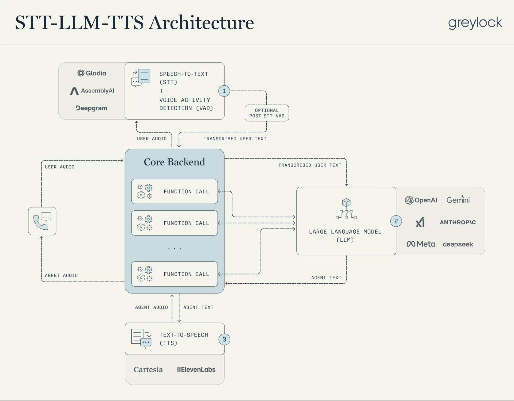
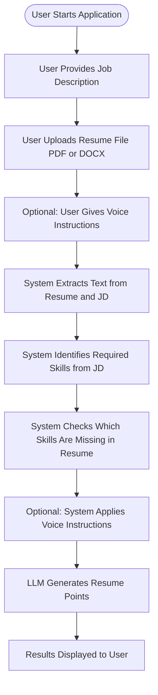
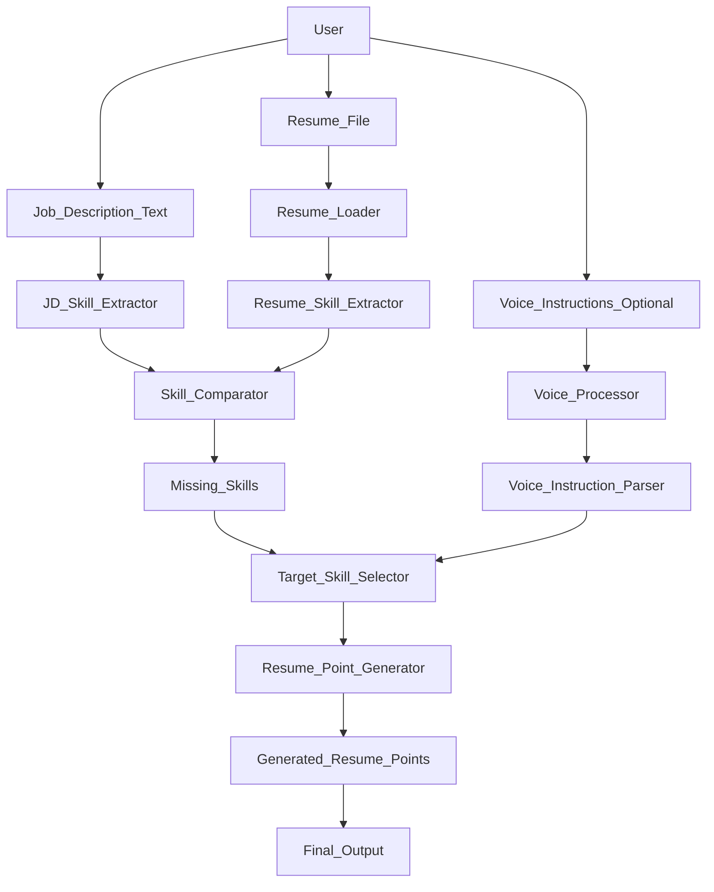
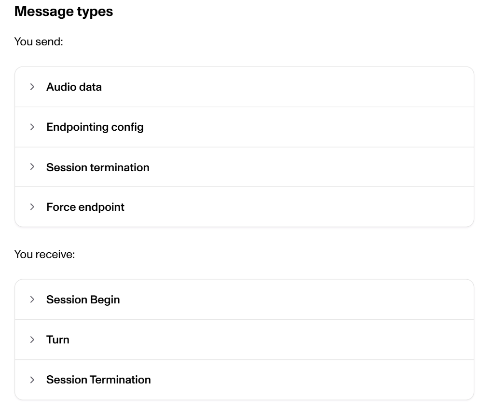

# JD-to-Resume Alignment Voice Agent:

## What are voice agents?

Voice agents are agents that can engage in natural spoken conversations with users. These agents combine speech recognition, natural language processing, generative AI, and text-to-speech technologies to create seamless, natural conversations.

Voice agents are software systems that allow humans to interact with machines using spoken language instead of keyboards or screens. Businesses are adopting voice agents because they handle conversations at scale, reduce operational costs, and provide faster responses than human-only teams. From customer support and banking to healthcare and sales, voice agents are becoming the first point of contact between companies and users. To truly understand voice agents, one must first understand the key concepts that power them. 

They’re suited for a variety of use cases, including:

Customer support

Personal assistants

Hands-free interfaces

Coaching and training
​
## How do voice agents work?

At a high level, every voice agent needs to handle three tasks:

Listen - capture audio and transcribe it

Think - interpret intent, reason, plan

Speak - generate audio and stream it back to the user

The difference lies in how these steps are sequenced and coupled.

Traditionally, building a voice assistant required chaining together several models: an automatic speech recognition (ASR) model like Whisper for transcribing audio, a text-based model for processing responses, and a text-to-speech (TTS) model for generating audio outputs. This multi-step process often led to delays and a loss of emotional nuance.

The voice component itself relies on two key technologies: Speech-to-Text (STT) and Text-to-Speech (TTS). STT is responsible for converting your speech into text, in simple terms, it “listens and writes.” The resulting text is then passed as input to the LLM. After the LLM generates a response, TTS performs the reverse process, converting that text back into speech.

# Basic Workflow:

## Overview:

This application helps users analyze how well their resume aligns with a given job description. It automatically identifies skill gaps and generates high-quality resume bullet points to strengthen the resume. The system also supports optional voice instructions, allowing users to guide the generation process using natural speech.

The tool is designed to be interactive, flexible, and practical for real-world resume optimization workflows.

## Key Features:

Resume parsing from PDF and DOCX formats

Job description understanding and skill extraction

Automated identification of missing or underrepresented skills

AI-generated, resume-ready bullet points

Optional voice-based user instructions to influence generation

Structured and readable output suitable for direct resume updates

## Workflow Description:

### 1. User Input

The workflow begins with the user providing:

A job description (pasted into the CLI)

A resume file (PDF or DOCX)

Optional voice instructions to guide the system (e.g., focusing on specific skills or technologies)

### 2. Resume and Job Description Processing

The system extracts text from both the resume and the job description. This text is normalized and prepared for analysis to ensure accurate skill identification.

### 3. Skill Identification

Using an LLM-based approach:

Required skills are extracted from the job description

Existing skills are extracted from the resume

These two sets are compared to identify skills that are missing or insufficiently represented in the resume.

### 4. Voice Instruction Handling (Optional)

If the user provides voice instructions:

The system transcribes the audio input

The transcription is cleaned and interpreted

Any explicitly mentioned focus areas (e.g., Java, AWS, cloud skills) are applied to guide the generation logic

Voice instructions can override default behavior by directing the system to generate resume points for specific skills, even if they are not missing.

### 5. Resume Point Generation

Based on the identified missing skills and/or user instructions, the LLM generates:

Structured resume bullet points

Two concise, impact-focused points per skill

Content aligned with the job description and professional resume standards

The output follows a grouped format, making it easy to integrate into an existing resume.

### 6. Output Presentation

The final results are displayed to the user in a clear and readable format, including:

The recognized voice instructions (if any)

The list of missing or targeted skills

AI-generated resume bullet points grouped by skill

This output can be directly reviewed, refined, or added to the resume.

# Architecture:

# AsemblyAI:
## Core concepts:
## Turn object:

A Turn object is intended to correspond to a speaking turn in the context of voice agent applications, and therefore it roughly corresponds to an utterance in a broader context. We assign a unique ID to each Turn object, which is included in our response.

**turn_order**: Integer that increments with each new turn

**turn_is_formatted**: Boolean indicating if the text in the transcript field is formatted. Text formatting is enabled when format_turns is set to true. It adds punctuation as well as performs casing and inverse text normalization to display various entities, such as dates, times, and phone numbers, in a human-friendly format

**end_of_turn:** Boolean indicating if this is the end of the current turn
transcript: String containing only finalized words

**end_of_turn_confidence:** Floating number (0-1) representing the confidence that the current turn has finished, i.e., the current speaker has completed their turn

**words:** List of Word objects with individual metadata
Each Word object in the words array includes:

**text:** The string representation of the word

**word_is_final:** Boolean indicating if the word is finalized, where a finalized word means the word won’t be altered in future transcription responses

**start:** Timestamp for word start

**end:** Timestamp for word end

**confidence:** Confidence score for the word

## Immutable transcription:

AssemblyAI’s streaming system receives audio in a streaming fashion, it returns transcription responses in real-time using the format specified above. Unlike many other streaming speech-to-text models that implement the concept of partial/variable transcriptions to show transcripts in an ongoing manner, Universal-Streaming transcriptions are immutable.

## Implement basic event handlers. These handlers let your app respond to key streaming events:

**on_begin** – Logs when the session starts.

**on_turn** – Handles each transcription turn and optionally enables formatted turns.

**on_terminated** – Logs when the session ends and how much audio was processed.

**on_error** – Captures and prints any errors during streaming.

## Summary:

This application provides an end-to-end solution for aligning resumes with job descriptions. By combining structured analysis, AI-driven generation, and optional voice guidance, it enables users to quickly enhance their resumes in a targeted and meaningful way.

# References:

https://www.assemblyai.com/docs/getting-started/transcribe-streaming-audio

https://www.assemblyai.com/docs/universal-streaming

https://github.com/langchain-ai/voice-sandwich-demo#readme

https://docs.langchain.com/oss/python/langchain/voice-agent

https://modal.com/blog/open-source-stt

https://huggingface.co/spaces/hf-audio/open_asr_leaderboard

https://greylock.com/greymatter/voice-agents-easy-to-use-hard-to-build/
